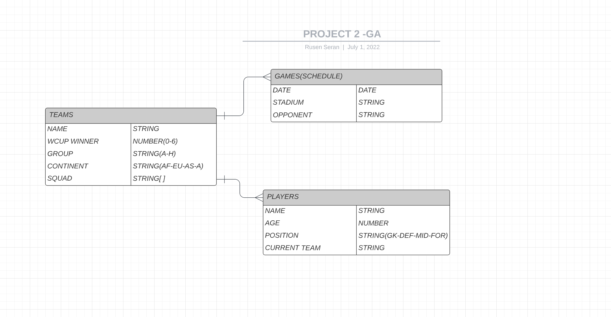

# Soccer Teams - Sport Tournament

### Purpose: You can create your teams, with their own players and schedule(games).

### ERD: https://lucid.app/lucidchart/b1678b17-f85e-49f5-8b56-e93de319ce19/edit?page=0_0&invitationId=inv_355f62f8-6c5f-4228-aded-5a36b9042b2e#

### TRELLO BOARD: https://trello.com/b/lRKyx5ii/project

[img]https://i.imgur.com/5Yu1T3D.png[/img]

### WIREFRAME: https://lucid.app/lucidchart/23d163e9-51a1-4030-b164-d18faea88a05/edit?viewport_loc=-288%2C-171%2C2889%2C1591%2C0_0&invitationId=inv_2f006e86-9347-4750-ad93-66a8bdb268b8#

## USED TECHNOLOGIES:
Node.js, MongoDB, Express, CSS, Bootstrap

## CHECK OUT THIS LINK: https://team-creator-sei523.herokuapp.com/

## ICEBOX: Add Game Results Page and Sport Data API